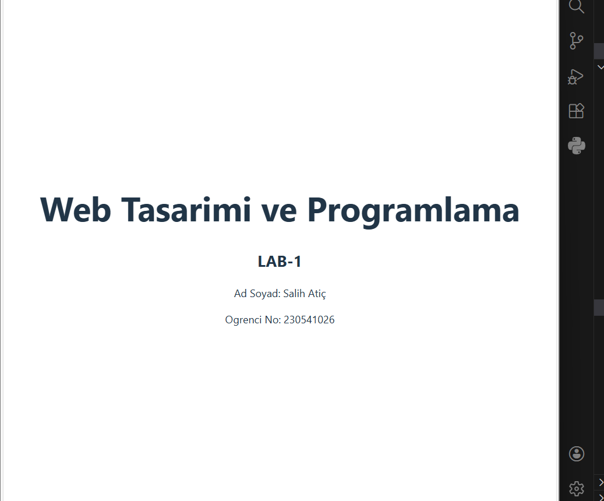

 # Web LAB-1- Hello Project
2
3 ## Hakkinda
4 Bu proje, Web Tasarimi ve Programlama dersi LAB-1 kapsaminda
5 Vite + React + TypeScript kullanilarak olusturulmustur.
6
7 ## Gelistirici
8- **Ad Soyad:** [Kendi Adin]
9- **Ogrenci No:** [Numaran]
10
11 ## Kullanilan Teknolojiler
12- React 18
13- TypeScript
14- Vite
15
16 ## Kurulum
17 ```bash
18 npm install
19 ```
20
21 ## Calistirma
22 ```bash
23 npm run dev
24 ```
26
27 ## Ekran Goruntusu
25 Tarayicida http://localhost:5173 adresini ac.
28 